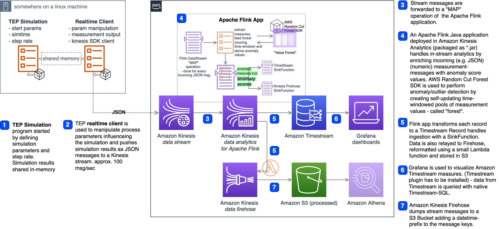

Flink anomaly detectors for industrial use cases
================================================




(1-6) refers to steps in Fig. 1
As a starting point for a realistic and data intensive measurement source we use an 
already existing (Tennessee Eastman Process - TEP) simulation framework written in C++ 
originally created from NIST and published as open source on GitHub 
[https://github.com/rcandell/tesim]. Our Blog repository on GitHub contains a small patch,
 which adds AWS connectivity with the SDKs and modifications to the command line arguments. 
 The programs used here provided by this framework are (1) a simulation process starter 
 with configurable starting conditions and timestep configs and (2) a real-time client 
 which connects to the simulation and sends the simulation output data to the AWS cloud.
  
### TEP background
A paper by Downs & Vogel from 1991 describes it this way: 
-	“This chemical standard process consists of a reactor/separator/recycle arrangement 
involving two simultaneous gas-liquid exothermic reactions.”
-	“The process produces two liquid products from four reactants. Also present are an 
inert and a byproduct making a total of eight components. Two additional byproduct 
reactions also occur. The process has 12 valves available for manipulation and 41 
measurements available for monitoring or control.“
The simulation framework used allows to control all of the 12 valve settings and produces 
41 measurement variables with varying sampling frequency.

### Data ingestion
Those 41 measurement variables, named `xmeas_1` to `xmeas_41`, are emitted by the 
real-time client (2) as key-value JSON messages. The client code is configured to produce
 100 messages per second. A built in C++ Kinesis SDK allows the real-time client to 
 directly stream json messages to a Kinesis DataStream (3).

### Stream Processing with Apache Flink
Messages sent to Amazon Kinesis DataStream are processed in configurable batch sizes 
by an Apache Flink application, deployed in Amazon Kinesis Data Analytics. Apache Flink 
is an open-source stream processing framework, written and usable in Java or Scala, and 
as seen in Figure 3, allows the definition of various data sources 
(e.g., a Kinesis DataStream) and data sinks for storing processing results. In between 
data can be processed by a range of operators – typically those are `mapping` and 
`reducing` functions (4). In our case we use a mapping operator where each batch of 
incoming messages is processed. As seen in `code snippet 1` we apply a custom mapping 
function to the raw data stream. For rapid and iterative development purposes it’s easy 
to have the complete stream processing pipeline running in a local Java/Scala IDE like 
Maven, Eclipse, IntelliJ etc. 
 


```java
public class StreamingJob extends AnomalyDetector {
---
  public static DataStream<String> createKinesisSource
    (StreamExecutionEnvironment env, 
     ParameterTool parameter)
    {
    // create Stream
    return kinesisStream;
  }
---
  public static void main(String[] args) {
    // set up the execution environment
    final StreamExecutionEnvironment env = 
      StreamExecutionEnvironment.getExecutionEnvironment();
---
    DataStream<List<TimestreamPoint>> mainStream =
      createKinesisSource(env, parameter)
      .map(new AnomalyJsonToTimestreamPayloadFn(parameter))
      .name("MaptoTimestreamPayload");
---
    env.execute("Amazon Timestream Flink Anomaly Detection Sink");
  }
}
```
code snippet 1: Flink Application Main Class


### In-stream anomaly detection
Within the Flink `mapping` operator a statistical outlier detection (we can call it 
anomaly detection) is executed. Flink easily allows the inclusion of custom libraries
 within its operators. The library used here is published by AWS – a Random Cut Forest 
 implementation available from GitHub (https://github.com/aws/random-cut-forest-by-aws ). 
 Random Cut Forest is a well understood statistical method which can operate on batches 
 of measurements and calculates an anomaly score for each new measurement by comparing a 
 new value with a cached pool (=forest) of older values. The algorithm allows the creation
  of grouped anomaly scores, where a set of variables is combined to calculate a single 
  anomaly score. Looking back to the simulated chemical process (TEP) we can group the 
  measurement variables into 3 process stages. a) the Reactor Feed Analysis b) the purge 
  gas analysis and c) the product analysis. Each group consists of 5 to 10 measurement 
  variables. So we’re getting anomaly scores for a, b and c. In `code snippet 2` we can 
  see how an anomaly detector is created. The class `AnomalyDetector` is instantiated 
  and extended then three times (for our 3 distinct process stages) within the mapping 
  function as seen in `code snippet 3`.
Flink distributes this calculation across its worker nodes and handles data deduplication 
processes under the hood.

```java
---
public class AnomalyDetector {
    protected final ParameterTool parameter;
    protected final Function<RandomCutForest, LineTransformer> algorithmInitializer;
    protected LineTransformer algorithm;
    protected ShingleBuilder shingleBuilder;
    protected double[] pointBuffer;
    protected double[] shingleBuffer;
    public AnomalyDetector(
      ParameterTool parameter,
      Function<RandomCutForest,LineTransformer> algorithmInitializer)
    {
      this.parameter = parameter;
      this.algorithmInitializer = algorithmInitializer;
    }
    public List<String> run(Double[] values) {
            if (pointBuffer == null) {
                prepareAlgorithm(values.length);
            }
      return processLine(values);
    }
    protected void prepareAlgorithm(int dimensions) {
---
      RandomCutForest forest = RandomCutForest.builder()
        .numberOfTrees(Integer.parseInt(
          parameter.get("RcfNumberOfTrees", "50")))
        .sampleSize(Integer.parseInt(
          parameter.get("RcfSampleSize", "8192")))
        .dimensions(shingleBuilder.getShingledPointSize())
        .lambda(Double.parseDouble(
          parameter.get("RcfLambda", "0.00001220703125")))
        .randomSeed(Integer.parseInt(
          parameter.get("RcfRandomSeed", "42")))
      .build();
---
    algorithm = algorithmInitializer.apply(forest);
  }
```
code snippet 2: AnomalyDetector base class, which gets extended by the Streaming 
Applications main class

```java
public class AnomalyJsonToTimestreamPayloadFn extends 
    RichMapFunction<String, List<TimestreamPoint>> {
  protected final ParameterTool parameter;
  private final Logger logger = 

  public AnomalyJsonToTimestreamPayloadFn(ParameterTool parameter) {
    this.parameter = parameter;
  }

  // create new instance of StreamingJob for running our Forest
  StreamingJob overallAnomalyRunner1;
  StreamingJob overallAnomalyRunner2;
  StreamingJob overallAnomalyRunner3;
---

  // use `open`method as RCF initialization
  @Override
  public void open(Configuration parameters) throws Exception {
    overallAnomalyRunner1 = new StreamingJob(parameter);
    overallAnomalyRunner2 = new StreamingJob(parameter);
    overallAnomalyRunner3 = new StreamingJob(parameter);
  super.open(parameters);
}
---
```
code snippet 3: Mapping Function uses the Flink RichMapFunction `open` routine to 
initialize 3 distinct `Random Cut Forests`

### Data persistence – Flink data sinks
Once all anomalies are calculated we can decide where to send this data to. Flink provides
 various ready to use data sinks. In the examples provided here we fan out all 
 (raw & processed) data to Amazon Kinesis Firehose for storing in S3 (long term)(5) and 
 to Amazon Timestream (short term)(5). Firehose is configured with a small Lambda 
 function to re-format data from json to csv and data is stored with automated 
 partitioning to S3. A Timestream data sink does not come pre-bundled with Flink. 
 Custom Timestream ingestion code is used in the examples provided here. Flink provides 
 extensible Operator Interfaces for the creation of custom Map and Sink-Functions.
 
### Timeseries handling
For the purpose of near real-time monitoring, Timestream in combination with Grafana is 
used. Grafana comes bundled with a Timestream data source plugin and allows to constantly 
query & visualize Timestream data (6).


